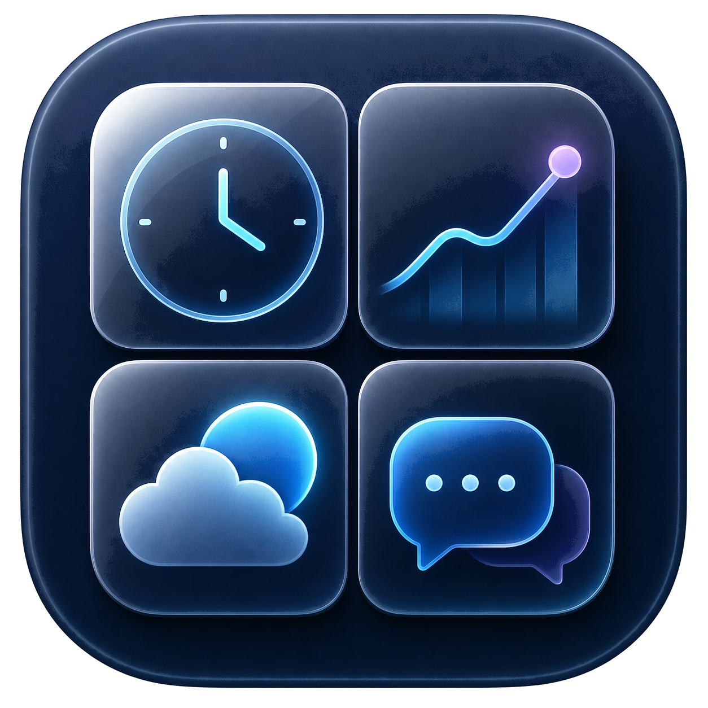

<p align="center">
  
</p>

<h1 align="center">DeskPulse</h1>

<p align="center"><strong>Your day. One screen. Zero tab chaos.</strong></p>

<p align="center">
  <a href="https://github.com/giladfr/DeskPulse/actions/workflows/ci.yml"></a>
  
  
  <a href="LICENSE"></a>
</p>

DeskPulse is a fast, native macOS command center for the screen that sits beside
you all day. Mail, messages, markets, weather, live news, Israeli radio and TV,
world clocks, and incoming-alert context—compact, movable, and visible at once.

No browser-tab archaeology. No Electron shell. Just SwiftUI, AppKit, WebKit, and
the information I actually want in front of me.

## The pulse

- **A dashboard that behaves like a desktop.** Drag every card, resize from any
  edge, snap to a visible grid, or let Auto arrange clean up what is already there.
- **Four personal layouts.** Click to restore; press and hold to overwrite. Open
  widgets and exact positions are remembered.
- **A live situation layout.** The red shield brings up clocks, date, WhatsApp,
  Israel Red Alert, Israeli radio, live TV, and every news stream. It can be saved
  like the other layouts.
- **Incoming-alert automation.** An optional antenna rule watches newly arriving
  Rotter headlines for `צבע אדום` and switches to the situation layout. If the
  HDMI screen is open, a red banner with the headline and a sound appear there
  too, with a one-click (or Return) jump to the dashboard.
- **Real resource control.** Toggling a widget off destroys its view, web session,
  player, and timers instead of merely hiding pixels.
- **Built for a permanent display.** Full screen, dark, dense, fluid, and quick to
  lock or keep awake from the top bar.
- **A second laptop, one swipe away.** A native, low-latency UVC/HDMI screen
  fills the Mac display from a capture card without routing video through a web
  view. It opens in its own full-screen Space, so you can swipe between the Mac
  desktop, the live dashboard, and the other laptop. The card's black bars are
  cropped automatically, and closing the HDMI screen releases the camera.

## Widgets

| Personal | Live information | Israel + world news | Audio + video |
| --- | --- | --- | --- |
| Gmail | AMD intraday | Ynet | Israeli radio |
| WhatsApp | Austin weather + forecast | Rotter סקופים | YouTube Music |
| World clocks | Today | CNN World | Channels 11, 12, 13 |
|  | Israel Red Alert | Fox News | CNN Live |

The AMD card shows the current session, previous-close baseline, premarket and
regular-session boundary, and extended-hours data when available. The radio card
supports station switching from the keyboard media controls and optional local
song recognition with prominent album art.

## Controls

- Click a colored icon in the top strip to open or fully close its widget.
- Drag a widget by its compact title bar; resize from its edges and corners.
- Use **1–4** to restore layouts, or press and hold a number to save over it.
- Use the **red shield** for the situation layout; press and hold it to save edits.
- Toggle the **antenna** for automatic incoming-alert detection.
- Toggle the **grid** to show snap points. Auto arrange aligns the current layout
  without throwing away its overall structure.
- The **lock** button locks the Mac. The sleep button toggles display sleep
  prevention while DeskPulse is running.
- Press **Control–Command–F** for full screen.
- Use the overlapping-displays button to open the HDMI screen in its own Space.
  Swipe between Spaces, or press **Escape** to jump to the dashboard; the HDMI
  picture keeps running. **Close** (or **Command–W**) releases the capture card.

## Build it

Requirements: macOS 14 or newer and Xcode/Swift 6. Optional radio song
recognition also needs Python 3.11+ to build its helper and `ffmpeg` at run time
(`brew install ffmpeg`; DeskPulse looks in `/opt/homebrew/bin`, `/usr/local/bin`,
`/opt/local/bin`, and `PATH`).

```sh
git clone https://github.com/giladfr/DeskPulse.git
cd DeskPulse
swift test
./build-app.sh
open /Applications/DeskPulse.app
```

`build-app.sh` creates a local song-recognition helper on first use, assembles the
app and installs it in `/Applications`. It signs with a local code-signing
identity named `DeskPulse Local Signing` when one exists and otherwise signs ad hoc.
To choose a stable identity explicitly—which helps WebKit and Keychain recognize
rebuilt copies as the same app—set it when building:

```sh
DESKPULSE_SIGNING_IDENTITY="Apple Development: Your Name" ./build-app.sh
```

You may also set `DESKPULSE_PYTHON` to a Python 3.11+ executable and
`DESKPULSE_BUNDLE_ID` to your own reverse-DNS identifier. The repository contains
the recognition source and build recipe, not an opaque prebuilt helper.

## Web sessions and privacy

DeskPulse itself has no analytics or telemetry. Gmail, WhatsApp, YouTube Music,
Red Alert, and live-TV surfaces are embedded websites; those providers receive
normal web requests and may store cookies or local data in DeskPulse's persistent,
app-specific WebKit store. Safari and Chrome sessions cannot be imported.

Credentials and session cookies stay in the local WebKit data store. DeskPulse
does not add them to its settings, source tree, or Git history. Links leaving a
widget's service domains open in the default browser.

Weather, quotes, feeds, streams, artwork, and recognition depend on external
services. Availability, accuracy, licensing, regional access, and provider terms
can change. DeskPulse is a personal dashboard—not an emergency alerting system,
trading platform, or authoritative news source.

## Make it yours

Adding a native widget is intentionally small:

1. Add a case to `WidgetKind`.
2. Define its title, SF Symbol, tint, and defaults in `Models.swift`.
3. Add its view in `WidgetContent.swift`.

Layout persistence, window chrome, drag, edge resize, toggling, tooltips, saved
layouts, and resource teardown come with it.

## License and third parties

DeskPulse source code is available under the [MIT License](LICENSE). That license
does not grant rights to third-party brands, feeds, websites, artwork, broadcasts,
or other content displayed by the app; those remain with their respective owners.

The optional recognition helper uses
[ShazamIO](https://github.com/dotX12/ShazamIO), an unofficial reverse-engineered
client that is not affiliated with or endorsed by Apple or Shazam. Its notice is
included in [Tools/THIRD_PARTY_NOTICES.md](Tools/THIRD_PARTY_NOTICES.md).

Security concerns should be reported privately as described in
[SECURITY.md](SECURITY.md).
